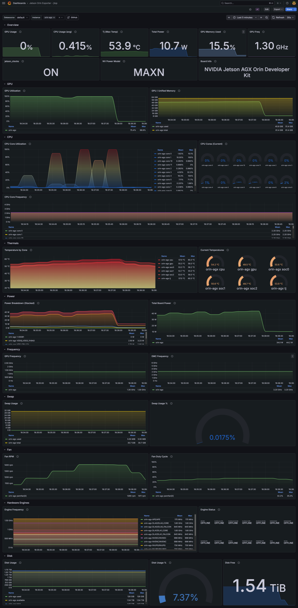

# jetson-orin-exporter



Prometheus exporter for NVIDIA Jetson Orin devices using [jetson-stats](https://github.com/rbonghi/jetson_stats) (`jtop`).

Exposes GPU, unified memory, per-core CPU, temperatures, power rails, fan, hardware engines, disk, and NV power profile as Prometheus metrics. Tested on **Jetson AGX Orin** and **Jetson Orin Nano**.

## Metrics

| Metric | Description |
|--------|-------------|
| `jetson_gpu_usage_percent` | GPU utilisation % |
| `jetson_gpu_freq_hertz` | GPU clock frequency (Hz) |
| `jetson_gpu_memory_used_bytes` | Unified memory used (bytes) |
| `jetson_gpu_memory_free_bytes` | Unified memory free (bytes) |
| `jetson_gpu_memory_total_bytes` | Unified memory total (bytes) |
| `jetson_cpu_usage_percent{core}` | Per-core CPU utilisation % — calculated as `100 - idle`, includes user+system+nice+iowait. No per-mode breakdown. |
| `jetson_cpu_freq_hertz{core}` | Per-core CPU frequency (Hz) |
| `jetson_temperature_celsius{zone}` | Temperature by thermal zone (°C) |
| `jetson_power_total_watts` | Total board power (W) |
| `jetson_power_rail_watts{rail}` | Per power rail (W) — rails vary by board |
| `jetson_fan_rpm{fan, index}` | Fan speed (RPM) |
| `jetson_fan_speed_percent{fan, index}` | Fan duty cycle % |
| `jetson_engine_freq_hertz{engine, unit}` | Hardware engine frequency (Hz) — DLA, NVENC, NVDEC, etc. |
| `jetson_engine_online{engine, unit}` | Hardware engine online status |
| `jetson_swap_used_bytes` | Swap used (bytes) — where available |
| `jetson_swap_total_bytes` | Swap total (bytes) — where available |
| `jetson_emc_freq_hertz` | EMC (memory controller) frequency (Hz) — where available |
| `jetson_disk_total_bytes` | Disk total (bytes) |
| `jetson_disk_used_bytes` | Disk used (bytes) |
| `jetson_disk_available_bytes` | Disk available (bytes) |
| `jetson_clocks_active` | jetson_clocks enabled (1=on, 0=off) |
| `jetson_nvpmodel_info{profile}` | Active NV power model/profile |
| `jetson_board_info{model, module, l4t, cuda}` | Static board information |

All frequencies are reported in Hz and all memory/disk values in bytes, following [Prometheus naming conventions](https://prometheus.io/docs/practices/naming/).

## Requirements

- NVIDIA Jetson Orin running Ubuntu 22.04 / JetPack 6
- [jetson-stats](https://github.com/rbonghi/jetson_stats) >= 4.3.0
- Python 3.8+

## Installation

**1. Install dependencies**

```bash
sudo pip3 install jetson-stats prometheus_client
# or
pip3 install -r requirements.txt
```

**2. Copy the exporter**

```bash
sudo mkdir -p /opt/jetson_exporter
sudo cp jetson_exporter.py /opt/jetson_exporter/
```

**3. Create a dedicated non-root user**

The exporter only needs access to the `jtop` daemon socket — no root required.

```bash
sudo useradd -r -s /bin/false -M jetson_exporter
sudo usermod -aG jtop jetson_exporter
```

**4. Install and start the systemd service**

```bash
sudo cp systemd/jetson_exporter.service /etc/systemd/system/
sudo systemctl daemon-reload
sudo systemctl enable --now jetson_exporter.service
```

**5. Verify**

```bash
systemctl status jetson_exporter.service
curl http://localhost:9101/metrics
```

## Prometheus scrape config

```yaml
scrape_configs:
  - job_name: jetson
    static_configs:
      - targets:
          - orin-agx:9101
          - orin-nano:9101
```

## Grafana dashboard

A ready-to-use dashboard is included at [`grafana-dashboards/jetson-orin-exporter-jtop.json`](grafana-dashboards/jetson-orin-exporter-jtop.json).

Import it via **Dashboards → Import → Upload JSON file** and select your Prometheus datasource.

## Tested on

| Board | JetPack | jtop |
|-------|---------|------|
| Jetson AGX Orin 64GB | 6.2 (L4T 36.5.0) | 4.3.2 |
| Jetson Orin Nano (Developer Kit Super) | 6.2 (L4T 36.5.0) | 4.3.2 |

## License

MIT
